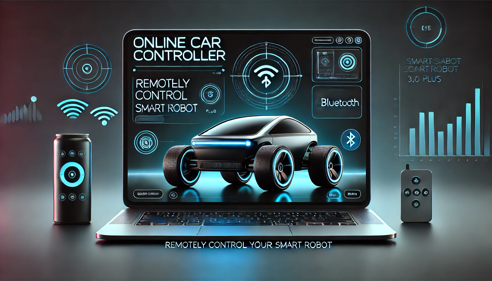

# 🚗 OnlineCarController

**OnlineCarController** es un proyecto experimental que fusiona el mundo de la robótica con el desarrollo web. Este proyecto te permite controlar el Smart Robot 3.0 Plus de Elegoo de forma remota, combinando dos potentes tecnologías:

- **Arduino:** Para manejar motores, sensores (ultrasonido e infrarrojo) y la comunicación Bluetooth.
- **React:** Una interfaz web (configurada con Vite) que utiliza la función experimental de Bluetooth en navegadores basados en Chromium para controlar el robot con el teclado o mediante parámetros específicos.

---

## 📖 Resumen del Proyecto

OnlineCarController integra dos componentes clave:
- **Control Robótico:** Utilizando Arduino y clases especializadas para gestionar la mecánica y sensores del robot.
- **Interfaz Web Interactiva:** Una aplicación React que se conecta vía Bluetooth (requiere activación de funciones experimentales en el navegador) y permite enviar comandos al robot de manera intuitiva.

Este es mi primer proyecto combinando React y Arduino, una experiencia de aprendizaje y experimentación en ambas áreas.

---

## 🗂️ Estructura del Repositorio
OnlineCarController/

    ├── Complete_Car_With_Classes/
        (Proyecto Arduino: Control de motores, sensores y Bluetooth)
        
    ├── public/
        (Recursos públicos para la aplicación React)
        
    ├── src/
        (Código fuente de la aplicación React)
        
    ├── package.json
        (Configuración y dependencias de React (Vite))
        
    └── README.md
        (Documentación del proyecto)

- **Complete_Car_With_Classes/**  
  Contiene el proyecto de Arduino con clases para:
  - 🚀 **Control de motores**
  - 📏 **Sensor ultrasonido**
  - 👁️ **Sensor infrarrojo** (usando la librería [IRremote](https://github.com/z3t0/Arduino-IRremote))
  - 🔵 **Comunicación Bluetooth**

- **Aplicación React (en la raíz):**  
  - 🖥️ Interfaz interactiva para controlar el robot.
  - 🎮 Permite el control mediante teclas o ingresando parámetros específicos (distancia, ángulo y velocidad).
  - 🔗 Conexión a Bluetooth (requiere activar la función experimental en navegadores basados en Chromium).

---

## ⚙️ Requisitos y Dependencias

### Para el proyecto Arduino:
- **Arduino IDE:** Última versión.
- **Librería:**  
  - [IRremote](https://github.com/z3t0/Arduino-IRremote) (para el sensor infrarrojo).

### Para la aplicación React:
- **Vite:** Utilizado para configurar y construir la aplicación.
- **Bluetooth en el Navegador:**  
  Es necesario activar la función experimental de Bluetooth en navegadores basados en Chromium para el correcto funcionamiento de la aplicación.

---

## 🌟 Características y Funcionalidades

### Arduino:
- **Control de Motores:** Gestión precisa del movimiento del robot.
- **Sensores:**
  - **Ultrasonido:** Medición de distancias para evitar obstáculos.
  - **Infrarrojo:** Utilizando la librería *IRremote* para detección.
- **Comunicación Bluetooth:** Recepción de comandos para un control remoto.

### Aplicación React:
- **Interfaz Web Interactiva:** Controla el robot a través de una aplicación moderna y responsiva.
- **Control por Teclado:** Envía comandos mediante pulsaciones de teclas.
- **Parámetros Personalizables:** Define la distancia, ángulo y velocidad a través de un formulario.
- **Bluetooth Experimental:** Conéctate al robot activando la función experimental en tu navegador y usando las claves correctas definidas en el código.

---

## 🔌 Notas Adicionales

- **Conexión Bluetooth:**  
  Asegúrate de activar la función experimental de Bluetooth en tu navegador (disponible en navegadores basados en Chromium). Luego, ingresa las claves correctas especificadas en el código para establecer la conexión con el robot.

- **Proyecto Experimental:**  
  Este es mi primer proyecto integrando React y Arduino, ¡y está lleno de aprendizajes y desafíos interesantes!

---

## 👤 Autor

- **[ALVNF](https://github.com/alvnf)**

---

## 💡 Contribuciones

¡Tus sugerencias y mejoras son bienvenidas! Si tienes ideas para expandir o mejorar el proyecto, no dudes en abrir un *issue* o enviar un *pull request*.

---

¡Diviértete explorando y experimentando con **OnlineCarController**! 🚀
